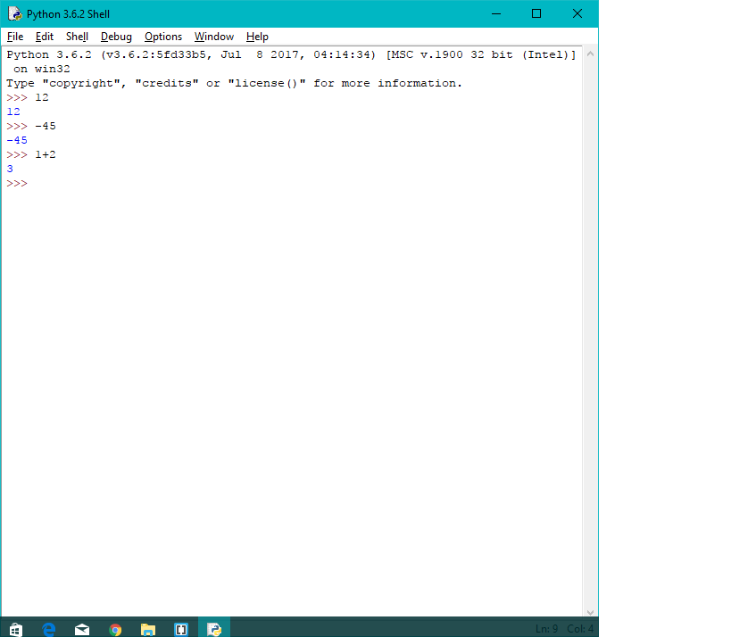

# Bắt đầu với Python

[Mở Python](install-python.md).

Bạn sẽ thấy con trỏ ở hiện ở dấu `>>>` có nghĩa là Python đã sẵn sàng để tiếp nhận câu lệnh (command). 

Rất đơn giản: Chúng ta nhập câu lệnh, nhấn Enter để chạy, nhập câu lệnh khác, nhấn Enter để chạy tiếp.

Bạn hẳn là chưa biết câu lệnh nào. Hãy thử một thứ đơn giản xem. Gõ hello và nhấn Enter.

```python
>>> hello
Traceback (most recent call last):
  File "<stdin>", line 1, in <module>
NameError: name 'hello' is not defined
>>>
```

Có gì đó lỗi rồi! Nhưng không sao cả. Python đã báo hello chưa được khai báo là làm gì.

Nếu ấn Enter mà không có câu lệnh thì sao?

```python
>>>
>>>
```

Chạy đấy, nhưng để làm gì?
Giờ hãy thử với số xem. Gõ một vài số ngẫu nhiên và Enter.

```python
>>> 12
12
>>> -45
-45
>>> 3.14
3.14
>>> 
```
    
Nó hiển thị số vừa nhập vào. Chú ý là để gõ số thập phân bạn sử dụng dấu chấm `.` thay vì phẩy.



Vậy nếu tôi gõ phẩy thì sao?

```python
>>> 25,9
(25, 9)
>>> 
```

Không có lỗi, nhưng cũng không phải số 25.9 như ta muốn!
Như vậy, hãy sử dụng dấu chấm. Chúng ta sẽ tìm hiểu (25,9) là gì sau.
## Comments

**Comments đơn giản là để giúp dễ đọc code hơn (hoặc vô dụng)** 
Bạn có thể tạo commnets bằng cánh gõ `#` và thêm một câu nào đó.
Tốt hơn hết là nó sẽ giải thích cho code bạn dễ hiểu hơn chẳng hạn. Chắc chắn bạn không muốn viết một comment thừa đâu nhỉ.

```python
>>> 1+2 	# Doan ket qua xem nao
3
>>> 
```

## Xâu - Strings

Strings là xâu các kí tự chúng ta sử dụng. String được viết trong dấu nháy.
Một số ngôn ngữ chỉ chấp nhận dấu nháy kép, tuy nhiên Python cũng chấp nhận cả dấu nháy đơn.

```python
>>> 'hello'
'hello'
>>> "have fun"
'have fun'
>>> "Toi co nhieu tien"
'Toi co nhieu tien'
>>> "It's me"
"It's me"
>>> 
```

Ở trên là một ví dụ về việc sử dụng dấu nháy đơn trong String khi cần thiết. 

Bạn cũng có thể ghép hai string bằng `+`, hoặc gấp nhiều lần lên bằng `*`.

```python
>>> "hello" + "world"
'helloworld'
>>> "you" * 3
'youyouyou'
>>> 
```

Chú ý: `#` trong string thì sẽ không phải comment.

```python
>>> "strings can contain # characters"
'strings can contain # characters'
>>> 
```

Bạn có thể in string ra màn hình với câu lệnh print. Ví dụ như:

```python
>>> print("Hello World")
Hello World
>>> 
```

Đây là chương trình Hello World mở đầu mỗi cái hướng dẫn đây. 

## Tính toán với Python

```diff
---------- Toán chán phèo. Cẩn thận ----------
```
Gõ vào phép toán vào xem

```python
>>> 15 + 46
61
>>> 24 - 3
21
>>> 15 * 8
120
>>> 16 / 5
3.2
>>> 17 / 3
5.666666666666667
>>> 
```

Python tính kết quả và in ra màn hình.

Lưu ý: Bạn không cách (ấn space) giữa các dấu toán tử thì kết quả vẫn đúng, nhưng gõ code như trên sẽ dễ đọc hơn là:

```python
>>> 15+46
61
>>> 24-3
21
>>>
```

Ba toán tử khá cần khác là số mũ `**`, lấy số dư `%` và lấy thương `//`:

```python
>>> 5**3
125
>>> 12%5
2
>>> 5//3
1
>>> 
```

Còn thứ tự tính thì cũng như toán thôi. 

```python
>>> 1 + 2 * 3       
7
>>> (1 + 2) * 3      
9
>>>
```

## Tóm tắt

- Chúng ta nhập command vào `>>>` (prompt)
- Python có thể tính toán như bình thường
- `#` bắt đầu comment.
- String sẽ ở trong dấu nháy.
- Bạn có thể sử dụng nháy đơn và nháy kép.
