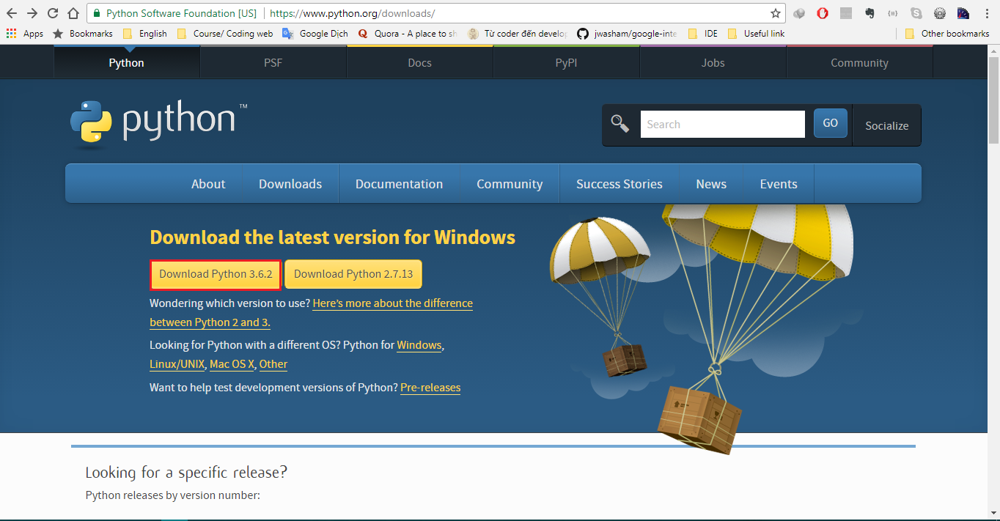
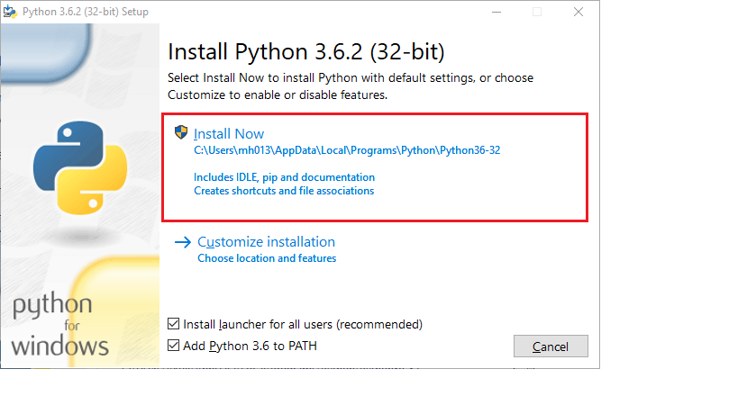
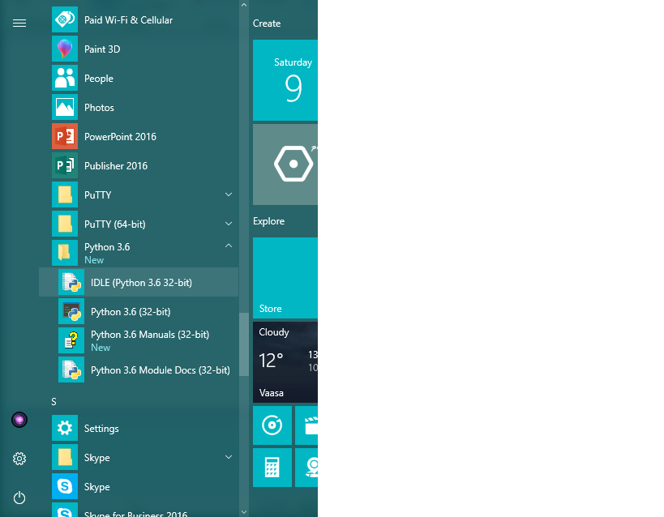

# Cài đặt Python

Dù bạn có thể chạy Python trên một trang web nào đó, nhưng mình vẫn khuyên nên cài đặt vào máy để thuận tiện hơn.

Sau đây là hướng dẫn cài đặt cho Window (sẽ update cho MacOS và Linux)

Bắt đầu nào!

## Tải về và cài đặt

### Windows

Khá giống với các chương trình bình thường khác.

1. Tới [trang download chính thức của Python](https://www.python.org/downloads/).
2. Lựa chọn nút màu vàng "Download Python 3.6.2" và tải về'

    
3. Chạy cài đặt.
4. Lựa chọn Install now (Chọn Yes nếu bị hiện ra cửa sổ hỏi thêm)

       
5. Cài đặt xong thì chọn Close. Như vậy là đã cài đặt xong rồi đó.
6. Tất nhiên bạn có thể chạy Python qua Terminal. Sẽ tốt cho lâu dài hơn. Tuy nhiên ở đây cho nhanh thì mình vẫn mở IDLE và chọn nó làm editor chính. Bạn có thể tìm IDLE ở thanh Start (góc trái dưới màn hình). Đây là ví dụ trên Windows 10.

    
    
## Tóm tắt
Bạn đã cài đặt Python xong rồi đó. Hãy chắc chắn bạn có thể mở nó!
