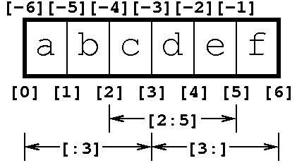

# String

Python string đơn giản là chuỗi các kí tự, có thể gọi là xâu.

```python
>>> our_string = "Hello World!"
>>> our_string
'Hello World!'
>>>
```

Trong các phần trước chúng ta đã biết cách nối.

```python
>>> "In ra: " + our_string
'In ra: Hello World!'
>>>
```

Hoặc in ra nhiều lần.

```python
>>> our_string * 3
'Hello World!Hello World!Hello World!'
>>>
```

String trong Python không thể thay đổi ngay tại chỗ được. Chúng ta cần tạo string mới để thay đổi string cũ. Kể cả `string1 += string2` cũng tạo ra string mới. Python sẽ thực hiện theo cách `string1 = string1 + string2`, nghĩa là nó tạo string mới ở vế phải và gán giá trị đó cho biến ban đầu.

Vậy còn gì để nghịch với string?

## Slicing

Slicing - đơn giản là chia ra, lấy một phần của string.

Lưu ý: Trong python kí tự đầu tiên ở `vị trí 0`.

Nếu chúng ta muốn lấy kí tự ở giữa kí tự thứ 2 và thứ 5 (bao gồm kí tự thứ 2 nhưng lại không bao gồm kí tự thứ 5):

```python
>>> string = 'abcdef'
>>> string[2:5]
'cde'
>>> 
```

Vậy cách slice là `string[start:end]`.

`[start:end]` là range trong Python, dãy số bắt đầu từ start tới end, bao gồm start nhưng lại không bao gồm end. Chúng ta sẽ còn sử dụng nhiều trong Python. 

Giá trị âm thì sao?

```python
>>> string[-5:-2]
'bcd'
>>> 
```

Vậy giá trị âm đơn giản là đếm từ cuối String ngược lại.

Bạn có thể tham khảo hình này



Nếu không ghi gì ở giá trị start nó sẽ mặc định là 0, và nếu không ghi gì ở giá trị end nó sẽ mặc định là độ dài của string. Ví dụ:

```python
>>> string[1:]
'bcdef'
>>> string[:-1]
'abcde'
>>> 
```

Bạn không thể thay đổi string theo kiểu này được:

```python
>>> string[:5] = "hello"
Traceback (most recent call last):
  File "<stdin>", line 1, in <module>
TypeError: 'str' object does not support item assignment
>>> 

```

Bạn có thể thêm bước nhảy vào slice chứ không nhất thiết phải lấy mọi ksi tự trong một khoảng, nhưng sẽ nói đến sau.

## Thứ tự 

Đa só mọi thứ trong lập trình đầu bắt đầu từ 0. **String bắt đầu từ 0**. Kí tự đầu tiên là `string[0]`, kí tự thứ 2 là `string[1]`, tiếp tục.
Với string là `abcdef` ta có thể thu được: 

```python
>>> string[0]
'a'
>>> string[1]
'b'
>>> string[2]
'c'
>>> string[3]
'd'
>>> string[4]
'e'
>>> string[5]
'f'
>>> 
```

Giá trị âm thì sao?

```python
>>> string[-1]
'f'
>>> 
```

Chúng ta được kí tự cuối cùng.

Lưu ý: `string[-1]` là kí tự cuối cùng, nhưng `string[1]` thì không phải là kí tự đầu tiên!

## String methods - Phương thức của string

Python hỗ trợ rất nhiều methods, bạn có thể xem sau đây (Tiếng Anh). 

[Official documentation](https://docs.python.org/3/library/stdtypes.html#string-methods)

Ở đây mình sẽ đưa ra một số methods thông dụng. Bạn cũng có thể `help(str)` để đọc. Bạn cũng có thể đọc thông tin về một method nào đó như  `help(str.upper)`. Tất nhiên là bằng tiếng Anh.

Đa số các method đều sẽ trả về một string mới, ví dụ `string = string.upper()` sẽ hoạt động vì nó tạo ra string mới sau đó gán giá trị vào string cũ.

Và lưu ý rằng đa số các method được gọi bằng cách `string.stuff()`, không phải `stuff(string)`. Nó có ý nghĩa là string biết làm tất cả những cái methods đó như thể `string.stuff()`, và không cần function riêng như `stuff(string)`.

Chúng ta sẽ tìm hiểu về methods sau này.

Một vài ví dụ về các methods thông dụng (l là left - trái, r là right - phải):

```python
>>> string.upper()		# Đưa về in hoa
'ABCDEF'
>>> string.lower()		# Đưa về in thường 
'abcdef'
>>> string.startswith('ab')	# Bắt đầu với 'ab' không
True
>>> string.endswith('ef')	# Kết thúc với 'ef' không
True
>>> string.endswith('eF')	# Python phân biệt kí tự hoa hay thường
False
>>> string.replace('ab', 'cd')
'cdcdef'
>>> string.replace('cd', 'ab')  # Thay toàn bộ 'cd' thành 'ab' đấy nhé
'ababef'
>>> string = 'abcdef'
>>> '  hello abc  '.lstrip()	# Bỏ khoảng trắng thừa phía bên trái
'hello abc  '
>>> '  hello abc  '.rstrip()	# Bỏ khoảng trắng thừa phía bên phải
'  hello abc'
>>> '  hello abc  '.strip()	# Bỏ hết khoảng trắng thừa hai bên
'hello abc'
>>> '  hello abc'.rstrip('cb')  # Bỏ các kí tự c và b bên phải
'  hello a'
>>> string.ljust(10, '-') 	# Không phải ai cũng rảnh gõ thêm đống dấu gạch bên trái cho đủ 10 kí tự. 
'abcdef----'
>>> string.rjust(10, '-')	# Hay bên phải string mà vẫn đủ 10 kí tự. 
'----abcdef'
>>> string.center(10, '-') 	# Thêm đều vào cả hai bên luôn này. Đếm xem đủ 10 kí tự không.
'--abcdef--'
>>> string.count('d') 		# Bao nhiêu kí tự 'd' trong string vậy?
1
>>> string.index('d')		# Vị trí đầu tiên của 'd' tính từ tay trái trở đi (đầu đến cuối)
3
>>> string.rindex('d')		# Vị trí đầu tiên của 'd' tính từ tay phải trở lại (cuối lên đầu)
3
>>> '-'.join(['hello', 'world', 'abc']) # Nối mấy string ở trong list lại bằng dấu `-`
'hello-world-abc'
>>> 'hello-world-test'.split('-')       # Giờ lại chia về list
['hello', 'world', 'test']
>>> string.upper()[2:].startswith('C')  # Nối nhiều thứ lại một chỗ cho gọn
True
>>> 
```

Ở đây split return lại list - danh sách. Chúng ta sẽ tìm hiểu trong bài kế tiếp.

## String formatting

Thêm string vào giữa string à?

```python
>>> name = 'Marry'
>>> 'My name is ' + name + '.'
'My name is Marry.'
>>>
```

Nhưng mọi thứ sẽ rắc rối hơn khi có nhiều thứ:

```python
>>> country = 'VN'
>>> "My name is " + name + " and I live in " + country + "."
'My name is Marry and I live in VN.'
>>>
```

Để thuận tiện hơn khi có nhiều string, chúng ta sử dụng `string formatting`.

Sau đây là một số cách:

- `.format()`-formatting, là phong cách formatting mới. Nhiều tính năng hơn, nhưng phải gõ nhiều hơn tí.

    ```python
    >>> "My name is {} and I live in {}.".format(name,country)
    'My name is Marry and I live in VN.'
    >>> 
    ```

- `%s`-formatting, là phong cách cũ, có thể gặp trong một số ngôn ngữ khác. Nó ít tính năng hơn `.format()`, nhưng gõ `%s` thì nhanh hơn đó. 

    ```python
    >>> "Hello %s." % name
    'Hello Marry.'
    >>> "My name is %s and I live in %s." %(name,country)
    'My name is Marry and I live in VN.'
    >>> 
    ```

- f-strings gọn hơn nữa, và là tính năng mới trong bản Python 3.6. **Hãy chắc chắn bạn sẽ chay code dùng cái này trong bản 3.6 trở lên.** Ở đây f viết tắt cho "format", và nội dung thì tương tự như `.format()` nhưng chúng ta có thể sử dụng tên biến trực tiếp luôn.

    ```python
    >>> f"My name is {name} and I live in {country}."
    'My name is Marry and I live in VN.'
    >>> 
    ```

## Một số methods khác
Sử dụng `in` and `not in` để xem một strng có chứa string khác không

```python
>>> string = "abcdef"
>>> "abc" in string
True
>>> "mno" in string
False
>>> "mno" not in string
True
>>>
```

Độ dài của string với `len` function. `len` viết tắt cho "length".

```python
>>> len(string)   # 'abcdef' có 6 kí tự
6
>>> len('')     # Không có gì
0
>>> len('\n')    # Đây là kí tự xuống dòng, nó cũng tính là một kí tự
1
>>>
```

Chuyển đổi giữa strings, integers và floats với `str`, `int` and `float`. 

```python
>>> str(3.14)
'3.14'
>>> float('3.14')
3.14
>>> str(456)
'456'
>>> int('456')
456
>>>
```

Nếu không chuyển được sẽ báo lỗi đó!

## Tóm tắt

- Slicing trả về một bản copy từ các kí tự giữa 2 vị trí.
- `string[index]` để lấy một kí tự. Chúng ta không cần `:` như slice.
- Bạn luôn có thể gọi trợ giúp như `help(str)` khi quên.
- String formatting sẽ thuận tiện cho việc thêm gì đó vào giữa các string. Bạn nên làm quen với 1 cách.
- `in` kiểm tra string này có chứa string kia không.
- `len(string)` trả về độ dài string.
- `str`, `int` và `float` sẽ chuyển đổi các kiểu dữ liệu.

## Bài tập 

Chạy trong file nhé

1. Chuyển về string-formatting cho dễ nhìn nào.

    ```python
    print("Hello!")
    word1 = input("Nhap 1 tu: ")
    word2 = input("Nhap tu thu 2: ")
    word3 = input("Nhap tu thu 3: ")
    word4 = input("Them 1 tu nua: ")
    print("Ban da nhap " + word1 + ", " + word2 + ", " + word3 + " va " + word4 + ".")
    ```

2. Viết hoa message cho nổi nào.

    ```python
    message = input("Noi gi day? ")
    message.upper
    print(message, "!!!")
    print(message, "!!!")
    print(message, "!!!")
    ```

Câu trả lời ở [đây](answers.md#String).

