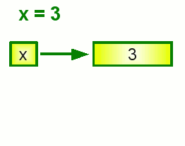

# Các loại biến và so sánh

## Biến - Variables

Biến đơn giản là **chỉ vào giá trị nào đó**. Chính xác hơn là chỉ vào bộ nhớ lưu trữ dữ liệu nào đó.

Do IDLE không hỗ trợ UNICODE tốt lắm nên comment trong IDLE sẽ không hiển thị được.
Do đó, mình gõ comment trên editor cho thuận tiện.
Nên bạn cũng không cần gõ comment theo đâu. Chỉ đọc để hiểu là được.
Bài cũng khá dài và hơi chán nên cố gắng làm theo. Cơ bản nên phải thế này.

```python
>>> x = 3   # tạo biến x và gắn cho x giá trị 3 (2 bước)
>>> y = 3   # tạo thêm biến khác
>>> x       # in ra giá trị của x
3
>>> y
3
>>> y = 2   # có thể thay đổi giá trị sau khi đã cài đặt, nên lúc này thì không có tạo biến y, chỉ có gắn giá trị
>>>
```




Bạn cũng có thể gán biến này bằng giá trị biến khác

```python
>>> x = 1
>>> y = x  # y sẽ chỉ tới giá trị 1, không phải a.
>>> x = 3
>>> y      # y không đổi khi x thay đổi
1
>>>
```

Gọi một biến chưa được khai báo sẽ gây ra lỗi 

```python
>>> num
Traceback (most recent call last):
  File "<pyshell#32>", line 1, in <module>
    num
NameError: name 'num' is not defined
>>> 
```

Biến rất đơn giản, nhưng chúng ta cần chú ý vài điều: 

- Biến sẽ chỉ tới giá trị, **chứ không phải là biến khác**.
- Nhiều biến có thể chỉ tới một giá trị, nhưng một biến không thể có nhiều giá trị.
- Giá trị mà biến chỉ tới cũng có thể chỉ tới một giá trị khác (sẽ tìm hiểu sau).

Biến là một phần quan trọng của lập trình, giúp cho lập trình đơn giản và ngắn gọn hơn.

Bên cạnh đó, tên biến phân biệt viết hoa viết thường, như những thứ khác trong Python:

```python
>>> num = 1
>>> NUM = 1
>>> nUm = 1
>>> num
1
>>> NUM
1
>>> nUm
1
>>>
```

Cũng có một số tên là **keywords**, chúng ta có thể dùng command `help('keywords')` để xem toàn bộ keyword.
Tuy nhiên chúng ta sẽ tìm hiểu sau.
Lưu ý: đặt tên keyword cho tên biến sẽ gây lỗi.

```python
>>> if = 123
  File "<stdin>", line 1
    if = 123
       ^
SyntaxError: invalid syntax
>>>
```

Khi thực hiện phép gắn x `=`, vế bên phải dấu bằng sẽ được thực hiện trước vế trái. 
Có nghĩa là ta có thể thực hiện phép tính với biến ở vế phải, sau đó gán kết quả vào chính biến đó ở vế trái.

```python
>>> x = 1
>>> x = x + 1
>>> x
2
>>>
```

Để ngắn gọn, chúng ta có thể sử dụng `+=`, `-=`, `*=`, `/=` thay vì `+`, `-`, `*`, `/`. 
Các phép lấy số dư, lấy thương, lũy thừa `%=`, `//=` và `**=` cũng ok hết.

```python
>>> x += 2          # x = x + 2
>>> x -= 2          # x = x - 2
>>> x *= 2          # x = x * 2
>>> x /= 2          # x = x / 2
>>>
```

Không chỉ có số nguyên đâu nhé.

```python
>>> a = 'hello'
>>> a *= 3
>>> a += 'world'
>>> a
'hellohellohelloworld'
>>>
```

## Đặt tên biến

Tên biến có thể gồm nhiều từ, có thể có chữ cái viết hoa, số, dấu gạch dưới `_` và các dấu khác.
Nhưng để viết tên biến nhiều từ, ta tách biệt bằng dấu gạch dưới và nên viết tên biến ở chữ thường cho đơn giản.

```python
>>> student_grade = 10
>>> myName = "John"
>>> student_grade = 10
>>> my_name = "John"
>>> tien_trong_tui = "vo han"
>>> 
```

Tuy rằng mình có sử dụng x và a trong ví dụ cho nhanh, nhưng trong lúc code, bạn nên tránh đặt tên biến như vậy.
Tên biến như thế sẽ chẳng có ý nghĩa gì cả, gây khó hiểu cho chính bạn và người khác.

## Booleans

Có hai giá trị Boolean, True and False (Đúng và Sai). Trong Python và rất nhiều ngôn ngữ khác, `=` là gán biến và `==` là so sánh.
`a = 1` là gán a bằng 1, còn `a == 1` kiểm tra xem a có bằng 1 không.

```python
>>> a = 1
>>> a == 1
True
>>> a = 2
>>> a == 1
False
>>>
```

`a == 1` giống như thể `(a == 1) == True`, nhưng `a == 1` sẽ gọn hơn, vì thế không cần viết thêm True.

```python
>>> a = 1
>>> a == 1
True
>>> (a == 1) == True
True
>>> a = 2
>>> a == 1
False
>>> (a == 1) == True
False
>>>
```

## Những loại so sánh khác

Nhìn dài đấy, nhưng cũng không khó đâu. Cố xem rồi dùng dần nhé.

| Cách dùng | Giải thích                        | Ví dụ True            |
|-----------|-----------------------------------|-----------------------|
| `a == b`  | a có bằng b hay không             | `1 == 1`              |
| `a != b`  | a khác b hay không                | `1 != 2`              |
| `a > b`   | a lớn hơn b phải không            | `2 > 1`               |
| `a >= b`  | a lớn hơn hoặc bằng b phải không  | `2 >= 1`, `1 >= 1`    |
| `a < b`   | a bé hơn b phải không             | `1 < 2`               |
| `a <= b`  | a bé hơn hoặc bằng b phải không   | `1 <= 2`, `1 <= 1`    |

Chúng ta cũng có thể ghép các phép so sánh với nhau bằng `and` và `or` (và, hoặc).

| Cách dùng | Giải thích                                | Ví dụ True                        |
|-----------|-------------------------------------------|-----------------------------------|
| `a and b` | a đúng và b đúng                          | `1 == 1 and 2 == 2`               |
| `a or b`  | a đúng , b đúng hoặc cả hai đúng          | `False or 1 == 1`, `True or True` |

`not` là cho ngịch đảo. Nếu `value` là True, `not value` là False, và nếu `value` là False, `not value` là True.

Có cả `is`, nhưng đừng dùng nó thay `==` trừ khi bạn hiểu rõ. Chúng ta sẽ tìm hiểu sau.

## Tóm tắt

- Biến có tên và giá trị. Chúng ta có thể tạo và đổi giá trị với `name = value`.
- `thing += stuff` giống hệt như `thing = thing + stuff`.
- Sử dụng tên biến đúng cách và nhớ rằng không ai thích ngồi tìm hiểu xem x là gì.
- `=` nghĩa là gán và `==` nghĩa là so sánh.
- True và False là Booleans. So sánh sẽ trả kết quả về dạng Boolean.
